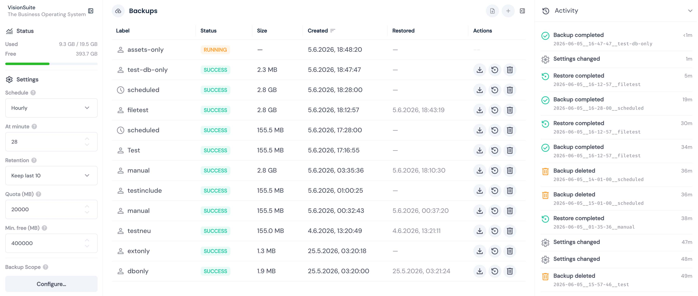
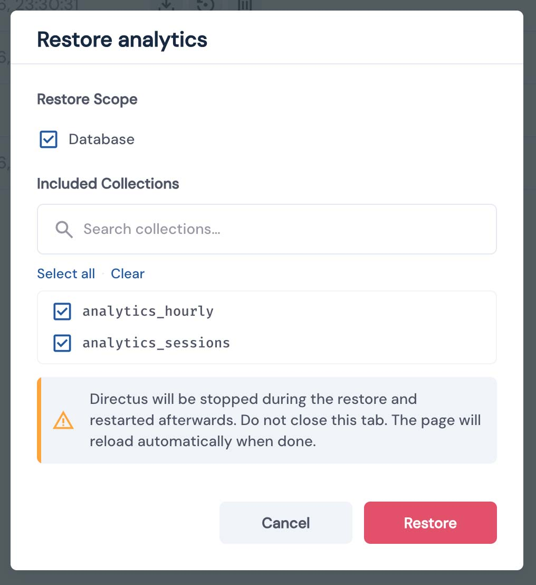
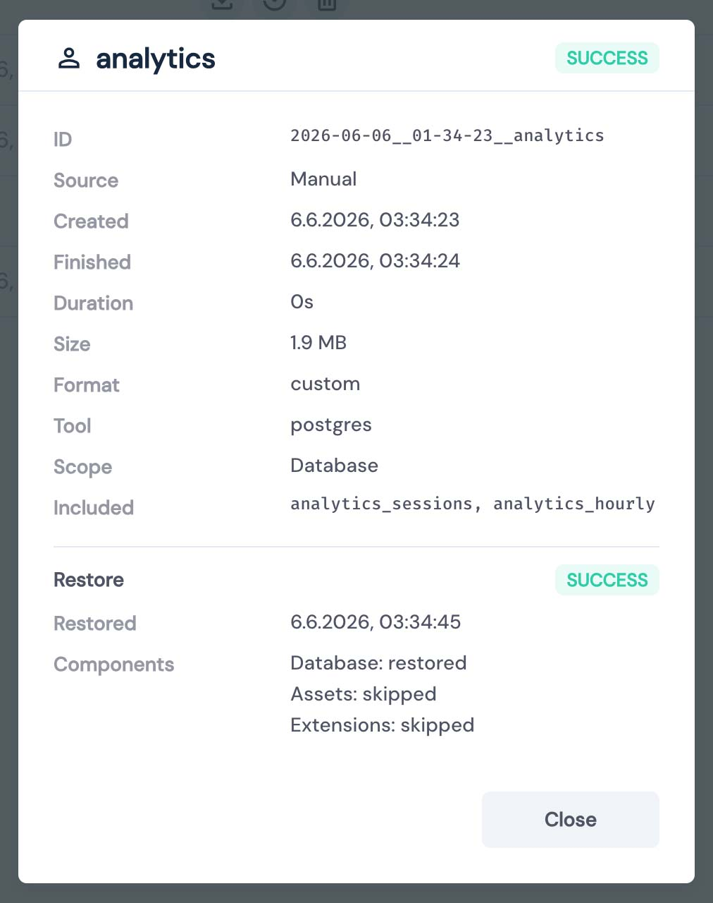

# Directus Backup

Full backup and restore system for Directus. Create, schedule, download, upload, and restore backups through a UI module in Directus Studio — powered by a dedicated sidecar container that keeps Directus unblocked during all operations.

## Features

- **Complete Directus backups** — database, uploads, and extensions in a single archive
- **Full & partial restore** — restore the entire system or individual collections directly from the UI
- **Selective scope** — choose which components to include, exclude specific collections
- **Scheduled backups** — configurable intervals (hourly to weekly) with automatic retention
- **Import & Export Backups** — Download and upload backups (must be enabled manually)
- **Localized UI** — full-featured backup module built into Directus Studio, currently available in English and German
- **Integrity verification** — SHA-256 checksums + row-count comparison on every restore
- **Disaster recovery** — CLI restore script works without Directus Studio
- **Storage management** — quota limits, free-space checks, automatic rotation
- **Pluggable DB adapters** — PostgreSQL built-in, extensible for MySQL/SQLite
- **Activity Logs** — Keep track of all operations
- **Admin notifications** — in-app alerts on scheduled backup failures

## Screenshots



|  |  |
| --- | --- |

## How It Works

A **sidecar container** runs alongside Directus and owns all backup and restore logic. It holds the database credentials, accesses the shared uploads and extensions volumes, and uses the Docker socket to stop and restart Directus during a restore. Because all heavy operations happen in the sidecar, Directus itself stays unblocked.

The **Directus extension** (UI module + API endpoint) is the thin front-end: it authenticates users via Directus's access control, then proxies requests to the sidecar over the internal Docker network.

See [Architecture](docs/architecture.md) for the full data flow, locking model, and manifest schema.

## Before You Start

> [!WARNING]
> **Beta Software** — This project is under active development and has not been tested across all possible configurations and environments. It is **not recommended** to run this directly in a production environment without prior testing in a staging setup. Feedback, bug reports, and contributions are very welcome and greatly appreciated.

> [!IMPORTANT]
> **Before deploying**, read the [Security documentation](docs/security.md). This system runs a privileged sidecar with Docker socket access and database credentials. Settings like `BACKUP_IMPORT_ENABLED` and `BACKUP_EXPORT_ENABLED` have significant security implications and are disabled by default for a reason.

## Quick Start

**1. Add the sidecar to your Docker Compose:**

```yaml
backup:
  image: ghcr.io/alphanull/directus-backup:latest
  restart: unless-stopped
  volumes:
    - ./backups:/directus/backups
    - /var/run/docker.sock:/var/run/docker.sock:ro
    - ./uploads:/directus/uploads
    - ./extensions:/directus/extensions
  environment:
    BACKUP_SECRET: ${BACKUP_SECRET}
    BACKUP_TOKEN: ${BACKUP_TOKEN}
    ADMIN_EMAIL: ${ADMIN_EMAIL}
    BACKUP_DIR: /directus/backups
    UPLOADS_DIR: /directus/uploads
    EXTENSIONS_DIR: /directus/extensions
    DB_HOST: database
    DB_USER: ${DB_USER}
    DB_PASSWORD: ${DB_PASSWORD}
    DB_DATABASE: ${DB_DATABASE}
    DIRECTUS_URL: http://directus:8055
    DIRECTUS_CONTAINER: ${COMPOSE_PROJECT_NAME}-directus-1
  depends_on:
    - directus
  healthcheck:
    test: ["CMD", "wget", "-qO-", "http://127.0.0.1:4700/health"]
    interval: 30s
    timeout: 5s
    retries: 3
  networks:
    - internal
```

**2. Install the extension** — either via the Directus Marketplace (search for `backup`; requires `MARKETPLACE_TRUST=all`, since the API endpoint is not sandboxed) or by copying the built extension into `extensions/directus-extension-backup/`. See [Installation](docs/installation.md) for both methods.

**3. Add env vars to your Directus service:**

```yaml
environment:
  BACKUP_URL: http://backup:4700
  BACKUP_SECRET: ${BACKUP_SECRET}
```

**4. Set the shared secret** — add a random `BACKUP_SECRET` to your `.env` (used by both services; required):

```sh
echo "BACKUP_SECRET=$(openssl rand -hex 32)" >> .env
```

**5. Restart:**

```sh
docker compose up -d
```

**6. Enable the module** — in Directus Studio, go to **Settings → Modules**, enable **Backup**, and save. The Backup module then appears for admin users.

See [docs/installation.md](docs/installation.md) for the complete setup guide.

## Documentation

- [Installation](docs/installation.md) — step-by-step setup
- [Configuration](docs/configuration.md) — schedule, retention, quota, scope
- [Security](docs/security.md) — trust model, authentication, import/export risks, warnings
- [Architecture](docs/architecture.md) — data flow, manifest schema, verification
- [DB Adapters](docs/db-adapters.md) — adapter interface, writing custom adapters
- [Development](docs/development.md) — local dev workflow, testing, deployment
- [examples/](examples/) — ready-to-use Docker Compose files and `.env.example`

## Planned / ToDos

- more adapters (mySQL etc)
- more robust access control
- more translations
- support configuring non-Directus tables in the scope UI (e.g. PostGIS extension tables or custom tables not registered in Directus); currently these are always backed up and restored silently — see [configuration docs](docs/configuration.md#non-directus-tables) for details

## License

Copyright (c) 2026 Frank Kudermann / alphanull

Licensed under the GNU Affero General Public License v3.0 only (AGPL-3.0-only).
See the [LICENSE](LICENSE) file for details.

Commercial licensing is available for use cases not covered by the AGPL
(e.g. integration into a closed-source product or a hosted/managed service).
Contact: [kudermann@alphanull.de](mailto:kudermann@alphanull.de)